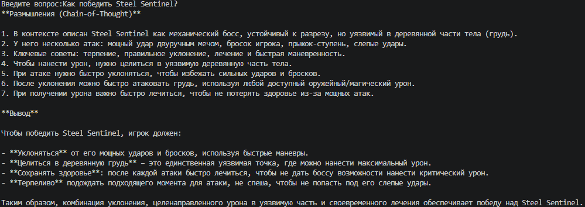
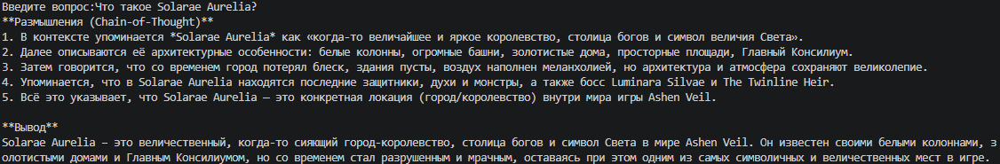
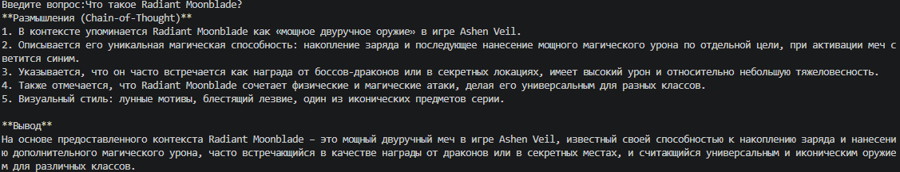
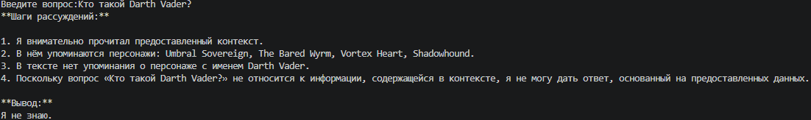

# Задание 4. Реализация RAG-бота с техниками промптинга

## Запуск бота

Для запуска RAG-бота необходимо выполнить следующие действия:

1. Установить зависимости
```
pip install -r requirements.txt
```
2. Предварительно подготовить индекс (задания 2 и 3)
3. Установить рабочую директорию заданием 4
```
cd Task4
```
4. В файле engine.py установить переменную `OPENROUTER_API_KEY` (ключ API OpenRouter)
5. Запустить бота
```
python bot.py
```

## Примеры диалогов


---

---

---
