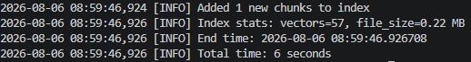
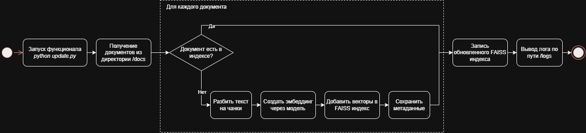

# Задание 6. Автоматическое ежедневное обновление базы знаний

## Скрипт обновления индекса

Скрипт обновления индекса `update.py` работает по алгоритму:
1. Проверяет директорию `docs` на наличие новых документов, которые отсутствуют в метаданных индекса.
2. При обнаружении новых документов - добавляет в индекс.

## Настройка периодического запуска

Настройка запуска через cron представлена ниже:

```
crontab -e

*/1440 * * * * cd <ПУТЬ ДО ДИРЕКТОРИИ> && python Task6/update.py >> Task6/logs/update.log 2>&1
```

В результате скрипт запускается каждые 24 часа и сохраняет вывод в `update.log`:



Ошибки в рамках обновления записываются в лог.

## Архитектурная диаграмма

