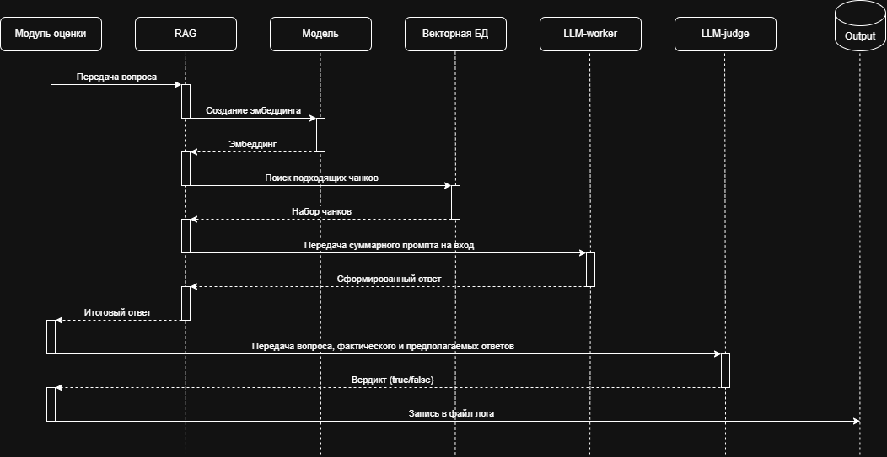

# Задание 7. Аналитика покрытия и качества базы знаний

## Анализ покрытия тем

Для анализа ответов используется та-же модель `openai/gpt-oss-20b:free` с другим промптом:
```
Вы нейтральный оценщик RAG-системы.

Вам будут даны:
- вопрос пользователя
- ожидаемый ответ
- фактический ответ, сгенерированный системой

Ваша задача:
1. Решить, корректен ли ответ.
2. Решить, правильно ли система себя повела (ответила или отказалась отвечать, если это уместно).
3. Обнаружить галлюцинации или неподтверждённые утверждения.

Возвращайте только "true", если фактический ответ похож на ожидаемый, иначе возвращайте "false"
```

Для запуска тестирования необходимо выполнить следующие действия:

1. Установить зависимости
```
pip install -r requirements.txt
```
2. Предварительно подготовить индекс (задания 2 и 3)
3. Установить рабочую директорию заданием 7
```
cd Task7
```
4. В файлах engine.py и evaluate.py установить переменную `OPENROUTER_API_KEY` (ключ API OpenRouter)
5. Запустить тест
```
python evaluate.py
```

Результаты тестирования выводятся в файл logs.jsonl.

По результатам тестирования проблем не выявлено.

## Диаграмма последовательности



Возможные проблемы:
1. Пустой или устаревший индекс (Векторная БД).
2. Слабый/шумный контекст (LLM-worker).
3. Неадекватная оценка (LLM-judge).